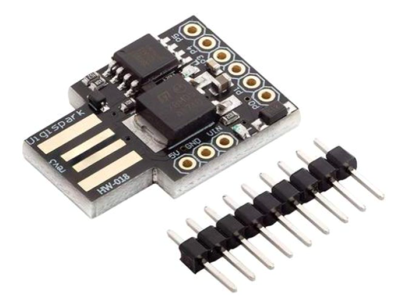
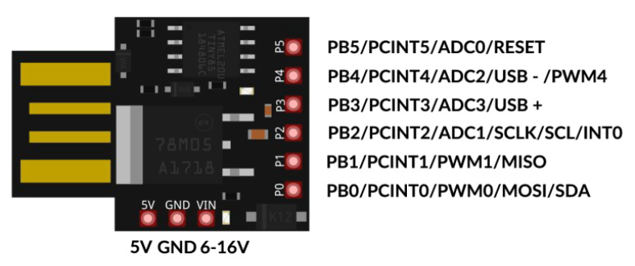

# DigiSpark

Localizzazione in italiano della libreria per la programmazione del microcontroller a 8 bit Digispark ATTiny85.

## _Nota dell'autore_

_Alcuni anni fa realizzai un progetto sui microcontrollori Arduino compatibili, con un focus particolare sul DigiSpark._

_Quel lavoro, supervisionato dall'allora docente dell'esame di Internet of Things, ha prodotto una documentazione che, trascorsi diversi anni, ho pensato ora di rendere pubblica, sperando che possa essere utile, come spunto o per curiosità, a qualche studente di materie STEM._

---

# Emulazione di periferiche USB tramite microcontrollori e rischi per la sicurezza informatica

&copy; G. Torre, 2021 
Progetto:
INTERNET OF THINGS 
INGEGNERIA INFORMATICA E DELL'AUTOMAZIONE (D.M. 270/04)

## Introduzione

La pervasività delle porte USB nei moderni computer rappresenta una grande comodità ma comporta
anche elevati rischi per la sicurezza.

Le porte USB, nei PC e Mac, consentono lo scambio di dati tra un gran numero di dispositivi ed il
Personal Computer, permettono di aggiungere con facilità periferiche senza preoccuparsi di riavviare
il sistema o del riconoscimento delle stesse e, non ultimo, offrono anche una moderata tensione che
può permettere la ricarica di dispositivi a basso consumo. Tuttavia, queste comodità hanno una
contropartita in termini di vulnerabilità, e ogni porta USB è di fatto una porta aperta verso il
potenziale rischio di accesso non autorizzato al sistema e la distruzione di dati o, peggio,
l’inserimento di codice malizioso che può originare problemi per la privacy e la sicurezza dei dati.

Il primo dispositivo commerciale di ampia notorietà capace di effettuare attacchi tramite porta USB è
stata la Rubber Ducky. Questa periferica richiedeva però la conoscenza di un linguaggio specifico
per la programmazione degli script e aveva una sua propria architettura.

Oggigiorno, tuttavia, grazie alla ampia diffusione dei microcontrollori (in particolare degli Arduino
compatibili), è diventato possibile costruire dispositivi del genere personalizzati, che è possibile
"camuffare" da chiavette USB e che, essendo sviluppati ad hoc, sono particolarmente elusivi nei
confronti di software di sicurezza (p.es Antivirus). In più, utilizzando Digispark, un microcontroller
compatibile con Arduino, il set di comandi per la programmazione di exploit è semplicemente quello
standard di Arduino e soprattutto le caratteristiche tecniche (16 MHZ a 5V) permettono di
mascherare queste board da periferiche USB (mouse, joystick o tastiere) fornendo in input al sistema
comandi che in realtà sono stati precaricati tramite sketch.

Questo tipo di attacchi può essere effettuato verso tutte le piattaforme: Windows, Mac e Linux,
previa personalizzazione degli script e della sintassi dei comandi eventualmente da eseguire.
Approfondiremo di seguito i dettagli sia implementativi che di programmazione di questo tipo di
interessanti e innovativi microcontrollori, e della loro contropartita in termini di rischi per la
sicurezza informatica.

### 1. - Il microcontrollore Digispark Rev.3 ATTiny85

In questa sezione esamineremo, con qualche dettaglio, la scheda di sviluppo microcontroller
Digispark basata sul chip microcontroller ATTiny85. Vedremo quindi quali sono le caratteristiche
del dispositivo, lo schema e la piedinatura. 
Passeremo quindi alla configurazione dell’ambiente operativo destinato alla programmazione del
microcontrollore; in particolare: configurazione dei driver per il riconoscimento da parte del sistema
operativo, connessione del dispositivo, riconoscimento della scheda dall’interno di Arduino IDE.

#### 1.1 - Overview

Il microcontrollore Digispark oggetto di questa tesina è una schedina di sviluppo microcontroller
compatta basata sul chip ATTiny85, un chip microcontroller a 8 bit ad alte prestazioni e bassa
potenza, prodotto un tempo da Atmel - oggi da Microchip -, con 8 KB di memoria flash
programmabile, di cui 2 KB necessari al micronucleo bootloader e 6 KB disponibili per i programmi.
Si tratta di un prodotto molto economico, acquistabile per pochi euro sugli store digitali, ma non per
questo di poco valore; il dispositivo è infatti un raffinato microcontrollore programmabile a 8 bit ad
alte prestazioni, dotato nativamente di un comodo connettore USB OTG e, per di più, compatibile
con Arduino, con cui può essere integrato nei progetti, e la cui programmazione può essere fatta
sfruttando lo stesso IDE, con alcune piccole personalizzazioni che vedremo più avanti.

**_Figura 1 - Il microcontrollore Digispark_** 
_(immagine tratta dalla documentazione venduta in bundle con la schedina da AZ-Delivery:_ 
AA.VV.: **Digispark Rev.3 ATTiny85 Quick-Start-Guide,** AZ-Delivery E-Book,
Vertriebs GmbH,  pag. 1)

#### 1.2 - Schema e caratteristiche

Le specifiche tecniche più importanti del dispositivo Digispark Rev.3 sono le seguenti:

| Caratteristica tecnica | Valore |
| :--- | :--- |
| Tensione d'esercizio | `2.7V – 5.5V (300µA)` |
| Tensione di alimentazione esterna | `6V - 12V (VIN pin)` |
| Pin Input/Output | `6 pin multiuso (analogico, digitale)` |
| Memoria | `8 KB (di cui 6 KB utilizzabili per i programmi)` |
| Dimensioni | `mm 20 x 19 x 6` |

Uno dei principali vantaggi di questo dispositivo è che esso può essere alimentato direttamente
tramite la porta USB incorporata ma, qualora questa fosse già impegnata per altro scopo (p.es.
interfacciamento del dispositivo con altri componenti),  può anche essere alimentato tramite tre pin
di alimentazione aggiuntivi. 

Il Digispark ha anche due led di bordo, necessari per capire se la scheda
sta funzionando e cosa sta facendo (p.es. alimentazione: _led fisso_; caricamento programma tramite
IDE: _lampeggiamento veloce_; etc.). Un led è appunto dedicato all’indicazione dell’alimentazione;
l’altro è un led di stato, collegato, nella Digispark Rev.3, al pin1 (PB1); ciò rappresenta un
vantaggio, perché nelle versioni con il led collegato al pin0 vi era la necessità di scollegarlo se si
voleva comunicare con dispositivi dotati di interfaccia I2C. 
La piedinatura del dispositivo è quindi la seguente:

**_Figura 2 - Piedinatura del Digispark Rev.3_**

